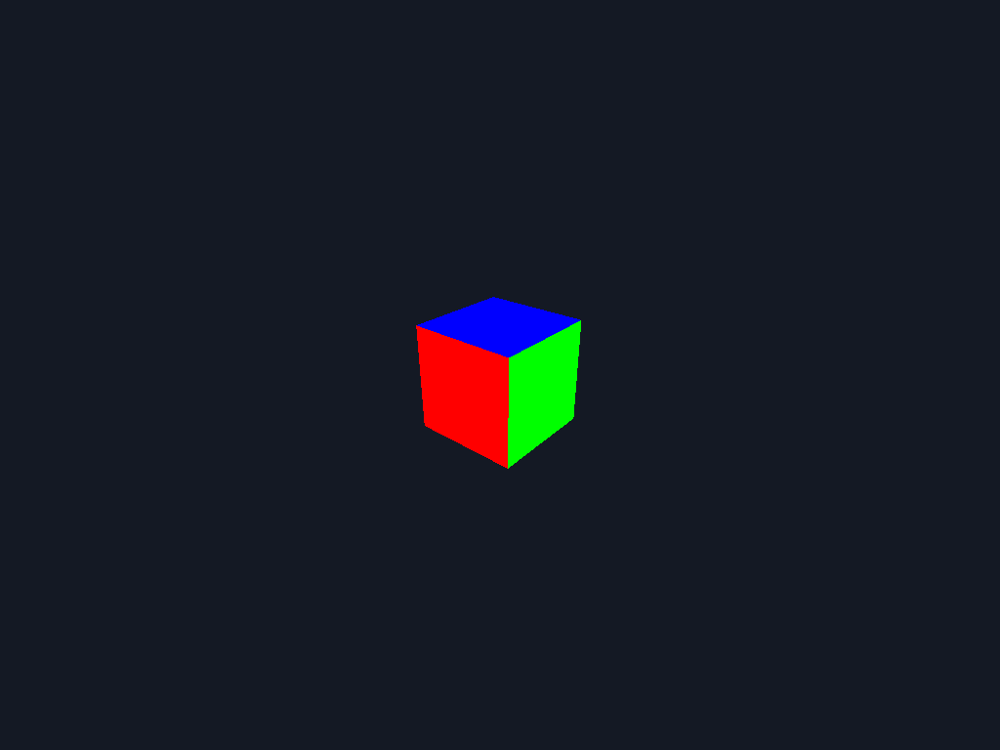

# pangolin-render-demo

A minimal headless 3D renderer built on [Pangolin](https://github.com/stevenlovegrove/Pangolin).
Draws a coloured cube via EGL (no X server needed) and writes the result to a PPM image.



The whole thing is ~40 lines of C++ plus a pixi manifest — useful as a starting point
for any "render OpenGL to image, no display" pipeline (batch rendering, CI snapshots,
synthetic dataset generation, etc.).

## Quick start

```sh
pixi install        # fetch pangolin-opengl + toolchain from conda-forge
pixi run render     # build and produce output.ppm
```

That's it. `output.ppm` is a 1024×768 raw RGB image. Convert it to PNG if you want:

```sh
convert output.ppm output.png        # ImageMagick
# or
pnmtopng output.ppm > output.png     # netpbm
```

## How it works

```
src/render_to_ppm.cpp     <- 40 lines: EGL context -> draw cube -> save PPM
CMakeLists.txt            <- find Pangolin, link, build
pixi.toml                 <- conda-forge env + tasks
```

The renderer:

1. `setenv("PANGOLIN_WINDOW_URI", "headless:", 1)` — selects Pangolin's EGL backend instead of X11.
2. `CreateWindowAndBind` — creates the offscreen GL context.
3. `DisplayBase().Resize(Viewport(0, 0, W, H))` — see [gotcha #2](#gotchas) below.
4. Standard Pangolin: projection + lookAt + view, then `glDrawColouredCube()`.
5. `ReadFramebuffer(view.v, "RGB24")` + `SaveImage(img, "output.ppm", false)` to write.

## Gotchas

Two non-obvious things about Pangolin 0.9.5 as packaged on conda-forge (`pangolin-opengl`):

**1. No PNG/JPEG/TIFF support compiled in.** The conda-forge build doesn't define
`HAVE_PNG` / `HAVE_JPEG` / etc., so calling `SaveImage("foo.png", ...)` errors with
*"Rebuild Pangolin for PNG support."* Formats that DO work out of the box:
`.ppm`, `.zstd`, `.p12b`, `.pango`. `SaveBmp` exists but is a stub
(throws "Not implemented"). Convert PPM to PNG downstream if you need PNG.

**2. `HeadlessWindow::ProcessEvents()` is a no-op.** Unlike the X11 backend, the
headless backend never emits a resize event after the window is created, so
`View::v` (the pixel viewport of any view created with `CreateDisplay`) stays
0×0 and you'll silently render nothing. Fix: call
`pangolin::DisplayBase().Resize(pangolin::Viewport(0, 0, W, H))` once after
`CreateWindowAndBind`. The resize cascades to child views.

## License

[WTFPL](LICENSE).
